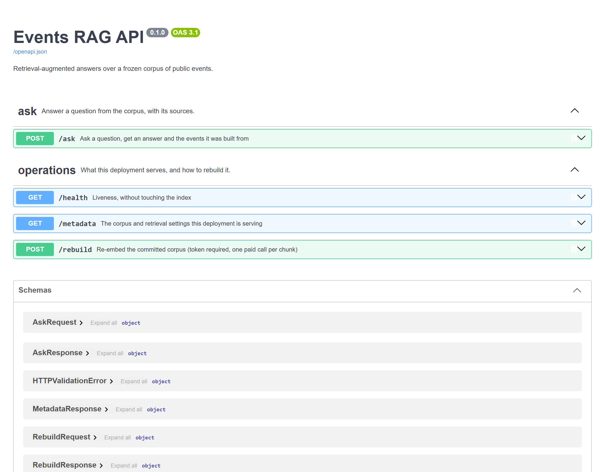
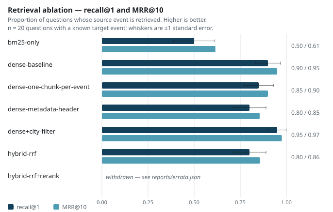

<h1 align="center">Events RAG</h1>

<p align="center">A question-answering API over a thousand public events, answered from the corpus or refused.</p>

<p align="center">
  
  
  
  
</p>

**Project status** — finished, and frozen with its corpus. The retrieval table on this page was
measured again on 2026-09-15 and came back identical, row for row; the generation numbers
date from the run of 2026-09-02, because the model account behind them has no chat quota
left, and every page that uses one says so. The thousand events and the twenty questions are
committed, so a key of your own re-measures the lot. The workflows still fire on every push
and every pull request; archiving the repository reduces them to a manual trigger.

## The problem

Public event listings are published as flat, faceted datasets: you filter by city, by date,
by category. What people actually ask is *"is there something for a three-year-old near
Alès during the holidays, and is it free?"*, a question that crosses four facets and names
none of them.

Retrieval-augmented generation is the obvious answer, and the obvious answer comes with a
trap. A RAG system is easy to build and hard to *measure*: the usual benchmark asks a
language model whether it likes the answer, which is expensive, non-deterministic, and
agrees with almost anything. Without a benchmark that can be wrong, no design choice in the
pipeline can be defended.

So this repository is built around two questions. **Can it answer the crossed question, and
what evidence would distinguish one retrieval configuration from another?**

The corpus is
[OpenAgenda's public events](https://public.opendatasoft.com/explore/dataset/evenements-publics-openagenda/),
restricted to Occitanie: 1 000 events, frozen.

## What it does

```console
$ curl -X POST localhost:8000/ask -H 'Content-Type: application/json' \
    -d '{"question":"Un atelier pour apprendre à réparer son vélo à Toulouse au printemps ?","top_k":3}'
```

```json
{
  "answer": "Voici un événement correspondant à votre demande :\n\n**Atelier d'initiation à la mécanique vélo**\n- **Ville** : Toulouse\n- **Date** : 19 mai 2026 à 13h00\n- **Lieu** : DSNA-DTI, 1 avenue du docteur Maurice Grynfogel\n\n*Remarque* : Aucun autre atelier de réparation vélo n'est mentionné pour Toulouse dans le contexte fourni.",
  "sources": [
    { "uid": "58859316", "title": "Atelier d'auto-réparation vélo", "city": "Perpignan",  "date": "2026-05-01T16:00:00+02:00" },
    { "uid": "4721721",  "title": "Atelier d'initiation à la mécanique", "city": "Toulouse", "date": "2026-05-19T13:00:00+02:00" },
    { "uid": "73449814", "title": "Atelier réparation vélos", "city": "Narbonne", "date": "2026-05-20T14:00:00+02:00" }
  ]
}
```

Real response, 2.5 s end to end. Retrieval returns three bike-repair workshops across the
region; generation picks the Toulouse one and says so when there is nothing else. Asked
about a concert in Paris, it refuses instead of inventing one, a behaviour the evaluation
set tests explicitly.

<!-- source: docs/images/MANIFEST.json -->


`/rebuild` is guarded by a token: rebuilding the index calls a paid API, so an anonymous
caller should not be able to trigger it.

### How it is built

A question arrives at a **FastAPI** route behind **Uvicorn**, validated by **Pydantic**
models that also serve as the OpenAPI page above. It is embedded with `mistral-embed` and
searched in a **FAISS** index built once from the committed corpus; the top chunks and the
question go to `mistral-small` through a **LangChain** chain whose prompt allows no source
but that context. Ingestion flattens each event to text plus metadata and cuts it at 800
characters, with `rank_bm25` available beside the dense index for the lexical half of the
ablation.

The choice worth defending is **FAISS on disk over a vector database**. A thousand events is
a few thousand vectors; a managed store would add a service to run, a schema to migrate and
a bill to pay, in exchange for headroom this corpus will never need. The index is a build
artefact: `scripts/build_index.py` writes it under `var/`, and the image rebuilds it in about
a minute.

Retrieval is graded against hard labels, so no model judges it. The generated answer has no
such label, and **RAGAS** grades that half instead: two of its five metrics return null on this
setup, and both are published as not measured.

Around the code: **pytest** in three tiers with coverage measured in the project
configuration, **Ruff** and **Bandit** on every push, **uv** for a locked environment, and
**Docker** for the one command that starts the API with its index already embedded.

## The result

Retrieval is scored on twenty questions that each record the `uid` of the event they were
written from, a hard relevance label, with `recall@k` and `MRR`, no judge involved. Seven
configurations, same questions, same corpus:

<!-- source: reports/ablation_results.json -->


<!-- source: reports/ablation_results.json -->
| Configuration | Chunking | recall@1 | recall@5 | MRR@10 | Median latency |
|---|---|---|---|---|---|
| `bm25-only` | baseline | 0.50 | 0.75 | 0.615 | 3.8 ms |
| `dense-baseline` | baseline | 0.90 | 1.00 | 0.950 | 192.7 ms |
| `dense-one-chunk-per-event` | one chunk per event | 0.85 | 0.95 | 0.900 | 165.6 ms |
| `dense-metadata-header` | metadata in text | 0.80 | 0.95 | 0.855 | 166.3 ms |
| `dense+city-filter` | baseline | 0.95 | 1.00 | 0.975 | 172.4 ms |
| `hybrid-rrf` | baseline | 0.80 | 0.95 | 0.857 | 210.2 ms |
| `hybrid-rrf+rerank` | baseline | 0.65 | 0.85 | 0.750 | 262.2 ms |
n = 20 questions for every row, run of 2026-09-15.

Every number above is read from `reports/ablation_results.json`, written by
`scripts/run_ablation.py`, and `tests/unit/test_published_numbers.py` fails if the table and
the file disagree. What each metric means, and what it is worth to someone using the service,
is in [`metrics.yaml`](metrics.yaml). The latency column is one machine's, measured in the
same run as the rest; it compares rows and travels to no other machine.

**The reranking row was withdrawn for two weeks, and here is what it hid.** The run that
first produced it scored the wrong text. The passage given to the cross-encoder was built as
one entry per event uid over 2 046 chunks, so for every event the splitter had cut, about
half the corpus, only the last chunk survived: usually the block carrying dates and prices.
The published 0.55 measured that mistake. `passages_by_uid` now reassembles the chunks of an
event before scoring, and a unit test checks that a two-chunk event reaches the scorer with
its title in the text. Measured again on the reassembled passages, the row reads 0.65 at
recall@1. The conclusion holds and the number that carried it was wrong by ten points, which
is the whole reason the row spent two weeks blank instead of quietly corrected.
[`reports/errata.json`](reports/errata.json) keeps the withdrawal and its resolution.

<!-- source: reports/paired_comparison.json -->
**What separates these configurations.** The seven answer the same twenty questions, so the
comparison is paired: what distinguishes two of them is the questions one gets right and the
other gets wrong, and averaging each side into a proportion throws exactly that away.
`scripts/compare_paired.py` reads the per-question ranks and runs McNemar's exact test
against the shipped configuration, over n = 20 questions:

<!-- source: reports/paired_comparison.json -->
| Against `dense-baseline`, recall@1 | Questions won | Questions lost | McNemar p |
|---|---|---|---|
| `bm25-only` | 0 | 8 | 0.008 |
| `hybrid-rrf+rerank` | 1 | 6 | 0.125 |
| `dense-metadata-header` | 0 | 2 | 0.5 |
| `hybrid-rrf` | 0 | 2 | 0.5 |
| `dense-one-chunk-per-event` | 1 | 2 | 1.0 |
| `dense+city-filter` | 1 | 0 | 1.0 |
n = 20 questions, the same twenty on both sides of every comparison.

One comparison out of twelve is decided at the 5 % level, and it is the floor: lexical search
alone loses eight questions to dense retrieval and wins none. Everything else, the city
filter included, sits where twenty questions cannot separate it. The interval of a single
proportion, about ±13 points here, says the same thing more conservatively.

**What it does show.** Dense retrieval puts the source event in the first five results for
all twenty questions; lexical search alone does it for fifteen. Above that floor, none of the
five remaining configurations separates itself by a margin twenty questions can support.
Query rewriting was not tried: it costs one model call per question, for a gain the
literature puts as marginal on short factual queries.

## Why these numbers can be believed

Because the benchmark they come from was rebuilt after the first one turned out to measure
the wrong thing.

The first run gave `recall@1` = 1.00 on the same twenty questions: every one of them
retrieved its source event at rank one. That is not a good result, it is a broken benchmark.
A perfect score means no headroom, so the ablation it exists for cannot rank anything. That
figure comes from the run of 2026-09-02 and is one of the two numbers on this page that
cannot be recomputed here, for the reason the next paragraphs give.

The tell was in the floor row: **BM25 alone, a bag of words with no embeddings at all,
reached 0.90 `recall@5` over a thousand events.** That is impossible on genuinely hard
questions.

The cause was that the questions had been generated by a language model *from the event
text*, and it quoted the titles verbatim: *"Quel est le titre du concert de Noël organisé
par Goma Espérance ?"*. `Goma Espérance` is a unique string in the corpus. The benchmark was
measuring exact string matching.

That deserved a number.
[`difficulty.py`](src/events_rag/evaluation/difficulty.py) measures how many of a question's
content words appear verbatim in the event it should retrieve. On the generated set, run on
2026-09-02, that mean overlap was 0.61.

The twenty positive questions were then rewritten by hand from the same seeded event sample,
same events, so nothing was cherry-picked, phrased the way someone looking for an outing
would phrase it, without reusing titles. `scripts/measure_difficulty.py` re-measures the set
that ships here:

<!-- source: reports/difficulty.json -->
| Question set | n | Lexical overlap |
|---|---|---|
| hand-written, committed | 20 | 0.5 |

The residue is mostly town names, which a user legitimately says out loud.

Every score dropped with the overlap, which is the point. On the generated set the floor row
`bm25-only` reached 0.70 at `recall@1` and `dense-baseline` reached 1.00; on the committed
set they read 0.50 and 0.90. Those two earlier figures come from the run of 2026-09-02 and
are the one pair of numbers here that cannot be re-measured: the generated question set was
replaced rather than kept, so nothing in this repository reproduces them. BM25 fell hardest,
exactly as the diagnosis predicted, because removing quoted titles hits pure lexical matching
first. The baseline dropped off the ceiling, so the benchmark can now separate
configurations, which is the only reason the table above is worth reading. The full protocol
is in [`docs/protocol.md`](docs/protocol.md).

### The scorer had defects too

Re-reading the grading code turned up four defects. Two of them had moved a published
number.

**The refusal detector missed every refusal it was built to catch.** It searched an answer
for the noun *événement*, and the model answers in the noun of the question: *« aucune
information concernant des opéras »*, *« aucun festival de cirque à Lyon »*. The five
out-of-corpus questions were therefore all recorded as wrong answers, on a run where the
system had refused each one correctly. The defect ran in the rare direction: it understated
the system on the capability that matters most here, saying no when the corpus holds no
answer. Detection matches negations now, and a test carries each of those five phrasings.

**The other three concern the keyword metric.** A refusal repeats the words of the question,
so its keyword coverage scored 1.0 by echo, and that echo was averaged in with the twenty
positive cases; a case carrying no keywords was handed a free 1.0 as well. Coverage is now
averaged over positive cases alone, carries its `n`, and returns nothing where there is
nothing to cover.

The thirty answers of that run cannot be asked again: the questions were replaced the same
day, and the account that paid for them has no chat quota left. They are committed in
[`reports/evaluation_2026-09-02.json`](reports/evaluation_2026-09-02.json), which keeps what
the defective scorer published beside what the current code reads from the same text. 22
correct and 5 wrong become 27 correct and none wrong; keyword coverage 0.908 over the thirty
cases becomes 0.938 over the twenty positive ones. `scripts/rescore_archive.py` recomputes
the corrected reading and calls no model, so the correction can be checked without a key.

## Running it

```bash
cp .env.example .env          # add EVENTS_RAG_MISTRAL_API_KEY
uv sync
uv run python scripts/build_index.py      # embeds the committed corpus, ~1 min
uv run python scripts/run_ablation.py     # writes reports/ablation_table.md
docker compose up                         # API on :8000, Swagger at /docs
```

The corpus in `data/raw/` and the question set in `data/questions/` are both committed, so
`run_ablation.py` reproduces the table above exactly. `plot_ablation.py` redraws
`reports/figures/ablation.svg` from `reports/ablation_results.json` afterwards, and records
the image in `reports/figures/MANIFEST.json`.

Two scripts deliberately sit outside that path, because both replace a frozen input:

- `build_dataset.py` re-ingests from the live upstream. Upstream is a rolling window, so
  running it builds a *different* corpus and silently invalidates every figure above. It is
  how you would bootstrap a corpus for another deployment, and the evaluation workflow has no
  ingestion step for the same reason.
- `generate_eval_dataset.py` regenerates the question set from scratch, with the same caveat.

Tests: `uv run pytest` — 180 tests in three tiers, no network. Coverage is measured on every
run, with a floor. Day-to-day operations are in
[`docs/operations.md`](docs/operations.md).

## Structure

```
src/events_rag/
├── ingestion/    OpenDataSoft client, cleaning, dataset assembly
├── rag/          chunking, FAISS index, retriever, prompts, service
├── evaluation/   metrics, search strategies, ablation harness, reporting
├── api/          FastAPI routes and schemas
└── utils/        where the files are, decided once
scripts/          thin entry points, one per operation
notebooks/        the lab: how the benchmark was found broken, and the ablation read closely
tests/            unit, integration and system tiers
data/raw/         the frozen corpus and its licence
data/questions/   the frozen question set the evaluation reads
reports/          published results, the figure, the errata and coverage
var/              the FAISS index and anything else a run leaves behind
```

Engineering decisions in [`docs/architecture.md`](docs/architecture.md); the API surface is
described by the generated OpenAPI schema at `/docs`, and what each route costs and how it
fails is in [`docs/operations.md`](docs/operations.md).

The reasoning behind the two sections above is in the notebooks, executed and committed with
their outputs: [`notebooks/01_benchmark_diagnosis.ipynb`](notebooks/01_benchmark_diagnosis.ipynb)
establishes that the first question set was broken and measures what replaced it, and
[`notebooks/02_retrieval_ablation.ipynb`](notebooks/02_retrieval_ablation.ipynb) reads the
seven configurations question by question, including the passages the reranker was given.
Neither writes anything: `uv sync --group notebook && uv run python scripts/run_notebooks.py`
replays them.

## What this does not prove

<!-- source: reports/ablation_results.json -->
**n = 20 is too small to rank close configurations.** Every conclusion above about small
differences is guarded for that reason. Two hundred questions would settle it; that is hours
of writing, and no change of method.

**The generation side has no current measurement.** The only RAGAS run this repository
carries is the one of 2026-09-02, and it graded a question set and a corpus that have both
been replaced since: two of the 139 events its answers cite are in the committed corpus,
which was widened from Montpellier to the whole region afterwards. Its numbers are kept in
`reports/ragas_2026-09-02.json` as the record of what was run, and no page reads them as a
property of what ships. Re-measuring needs chat quota on a model account, which this one no
longer has.

**And that evaluation was circular by construction.** The hand-written questions fixed the
*retrieval* benchmark; the reference answers RAGAS grades against are still derived from the
events themselves, so faithfulness and relevancy come out optimistic whoever runs them.
Fixing that means writing reference answers blind, which is a different exercise.

**One of the five RAGAS metrics does not work.** `answer_relevancy` came back null on every
answer of the archived run, and it is reported as not measured: a null rendered as zero would
read as a measured score of nothing. The summary claimed two until the archive was made
recomputable — it read `context_relevancy` from a column named after the metric, while RAGAS
writes that one into `nv_context_relevance`. Each mean now carries the number of rows it was
taken over, which is how `context_precision` turned out to be a mean over 26 of the 30.

**The RAGAS integration imports private symbols, and there is no alternative.** As of 0.4.3
the library exposes no public path to its concrete metrics: `ragas.metrics.__all__` holds
none of them and every metric module is itself underscore-prefixed. The mitigation is a
version cap, `ragas>=0.4.3,<0.5`, so that an unrelated dependency sync cannot pull a release
where that surface has moved. Depending on a private API is a real liability; the cap makes
it a scheduled one.

**The evaluation questions are still written by a language model**, by me and not by
Mistral, which removes the same-family bias between question and embedding without making
the set human. Saying otherwise would be dressing it up.

**The corpus is frozen deliberately.** Upstream is a rolling window, so re-ingesting gives a
different corpus and no number here would reproduce. See
[`data/raw/SOURCE.md`](data/raw/SOURCE.md) and
[`docs/data-source.md`](docs/data-source.md).

## Licence and data

Code under [MIT](LICENSE).

The event data is redistributed under the
[Licence Ouverte / Open Licence v1.0](https://www.etalab.gouv.fr/wp-content/uploads/2014/05/Licence_Ouverte.pdf),
published by OpenAgenda and distributed by OpenDataSoft. The corpus is committed so that the
figures above reproduce; [`docs/data-source.md`](docs/data-source.md) records where it came
from, when, and what the licence allows.
