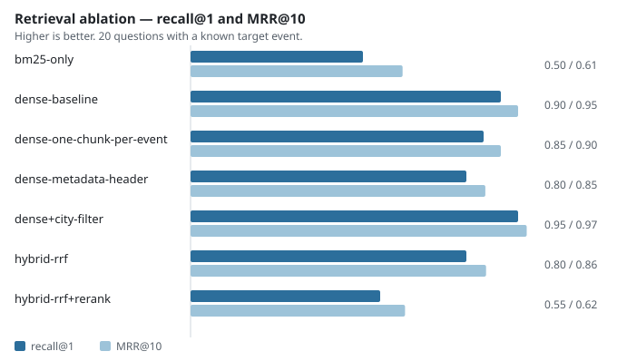

# Events RAG

A retrieval-augmented question answering API over a thousand public cultural events in
Occitanie. Ask it in plain French what there is to do in your town, and it answers from
the corpus — or says it does not know.

## Project status

**This repository is archived in a runnable state.** No service is running behind it: the
API keys have been revoked and the continuous integration workflows are frozen to
manual trigger only, deliberately, so that nothing here can quietly rot into a red cross
on an unmaintained project. Their last successful runs remain visible in the Actions tab.

Everything below is reproducible locally with `docker compose up` and a Mistral API key.
The event corpus is committed, so the numbers in this README can be recomputed exactly —
see [Reproducing the results](#reproducing-the-results).

## The problem

Public event listings are published as flat, faceted datasets: you filter by city, by
date, by category. What people actually ask is *"is there something for a three-year-old
near Alès during the holidays, and is it free?"* — a question that crosses four facets
and names none of them.

This is a proof of concept for answering that kind of question over
[OpenAgenda's public events](https://public.opendatasoft.com/explore/dataset/evenements-publics-openagenda/),
restricted to Occitanie.

## What it does

```console
$ curl -X POST localhost:8000/ask -H 'Content-Type: application/json' \
    -d '{"question":"Un atelier pour apprendre à réparer son vélo à Toulouse au printemps ?","top_k":3}'
```

```json
{
  "answer": "Voici un événement correspondant à votre demande :\n\n**Atelier d'initiation à la mécanique vélo**\n- **Ville** : Toulouse\n- **Date** : 19 mai 2026 à 13h00\n- **Lieu** : DSNA-DTI, 1 avenue du docteur Maurice Grynfogel\n\n*Remarque* : Aucun autre atelier de réparation vélo n'est mentionné pour Toulouse dans le contexte fourni.",
  "sources": [
    { "uid": "58859316", "title": "Atelier d'auto-réparation vélo", "city": "Perpignan",  "date": "2026-05-01T16:00:00+02:00" },
    { "uid": "4721721",  "title": "Atelier d'initiation à la mécanique", "city": "Toulouse", "date": "2026-05-19T13:00:00+02:00" },
    { "uid": "73449814", "title": "Atelier réparation vélos", "city": "Narbonne", "date": "2026-05-20T14:00:00+02:00" }
  ]
}
```

Real response, 2.5 s end to end. Retrieval returns three bike-repair workshops across the
region; generation picks the Toulouse one and says so when there is nothing else. Asked
about a concert in Paris, it refuses rather than inventing one — a behaviour the
evaluation set tests explicitly.

Four endpoints: `/health`, `/metadata`, `/ask`, `/rebuild`.

## Approach

Ingestion pulls events from the OpenDataSoft API, flattens them to text plus metadata,
and chunks them at 800 characters. Chunks are embedded with `mistral-embed` into a FAISS
index. At query time the top chunks become the context for `mistral-small`, behind a
prompt that instructs it to answer only from that context.

The one choice worth defending: **FAISS on disk rather than a vector database.** A
thousand events is a few thousand vectors. A managed vector store would add a service to
run, a schema to migrate and a bill to pay, in exchange for scaling headroom this corpus
will never need. The index rebuilds from the committed corpus in about a minute.

## Evaluation, and what it took to make it mean anything

This is the part I would read first, so it comes before the stack.

### The first benchmark was worthless, and it looked perfect

Evaluating a RAG system on whether an LLM judge likes the answer is expensive and
non-deterministic. So the evaluation set records, for each question, the `uid` of the
event it was written from — a hard relevance label — and retrieval is scored with
`recall@k` and `MRR`, no judge involved.

The first run gave **`recall@1` = 1.00**. Every question retrieved its source event at
rank one.

That is not a good result, it is a broken benchmark. A perfect score means no headroom:
no configuration can beat it, so the ablation it was built for cannot rank anything. The
tell was in the floor row — **BM25 alone, a bag of words with no embeddings at all,
reached 0.90 `recall@5` over a thousand events.** That is impossible on genuinely hard
questions.

The cause was that the questions had been generated by an LLM *from the event text*, and
it quoted the titles verbatim: *"Quel est le titre du concert de Noël organisé par Goma
Espérance ?"*. `Goma Espérance` is a unique string in the corpus. The benchmark was
measuring exact string matching.

I put a number on it rather than leaving it as an impression:
[`difficulty.py`](src/events_rag/evaluation/difficulty.py) measures how many of a
question's content words appear verbatim in the document it should retrieve. The
generated set scored **0.61**.

### Rebuilding the set by hand

The twenty positive questions were rewritten by hand from the same seeded event sample —
same events, so no cherry-picking — phrased the way someone looking for an outing would
phrase it, without reusing titles. Overlap fell to **0.50**; the residue is mostly town
names, which a user legitimately says out loud.

Every score dropped, which is the point:

| | generated set | hand-written set |
|---|---|---|
| lexical overlap | 0.61 | **0.50** |
| `bm25-only` `recall@1` | 0.70 | **0.50** |
| `dense-baseline` `recall@1` | 1.00 | **0.90** |

BM25 fell hardest, exactly as the diagnosis predicted: removing quoted titles hits pure
lexical matching first. The baseline dropped off the ceiling, so the benchmark can now
separate configurations.

### The ablation



| Configuration | Chunking | recall@1 | recall@5 | MRR@10 | Median latency |
|---|---|---|---|---|---|
| `bm25-only` | baseline | 0.50 | 0.75 | 0.615 | **3.8 ms** |
| `dense-baseline` | baseline | 0.90 | **1.00** | 0.950 | 159 ms |
| `dense-one-chunk-per-event` | one chunk per event | 0.85 | 0.95 | 0.900 | 164 ms |
| `dense-metadata-header` | metadata in text | 0.80 | 0.95 | 0.855 | 180 ms |
| `dense+city-filter` | baseline | 0.95 | **1.00** | 0.975 | 216 ms |
| `hybrid-rrf` | baseline | 0.80 | 0.95 | 0.857 | 178 ms |
| `hybrid-rrf+rerank` | baseline | 0.55 | 0.70 | 0.622 | 208 ms |

**What this does not show.** The city filter tops the table, but 0.95 against 0.90 is
**one question out of twenty**. At n = 20 the standard error is about 6.7 points, so the
95 % interval is roughly ±13. That difference is well inside the noise and I am not
claiming it as an improvement.

**What it does show.** Reranking clearly hurts — 0.55 against 0.90 is far outside the
noise — and the cause is identifiable: `ms-marco-TinyBERT-L-2-v2` is a small
cross-encoder trained on English, applied to French. Dropped, and the row is left in the
table because a tried-and-abandoned path is information.

**The honest conclusion:** on this corpus, at this sample size, none of the five
alternatives beats plain dense retrieval by a margin the evidence supports. Query
rewriting was not tried at all — one LLM call per query for a gain the literature puts as
marginal on short factual questions.

## Limitations, and what I would do differently

**The generation side is still evaluated circularly.** The hand-written questions fixed
the *retrieval* benchmark, but the reference answers are still derived from the events
themselves, so RAGAS's faithfulness and relevancy numbers remain optimistic. Fixing that
means writing reference answers blind, which is a different exercise.

**Two of the five RAGAS metrics do not work.** `answer_relevancy` and `context_relevancy`
return null. They are reported as not measured rather than shown as zero, and the module
still imports private RAGAS symbols that will break on the next upgrade.

**n = 20 is too small to rank close configurations.** Every conclusion above about small
differences is guarded for that reason. Two hundred questions would settle it; that is
hours of writing, not a change of method.

**The evaluation questions are still written by a language model** — by me rather than by
Mistral, which removes the same-family bias between question and embedding, but does not
make the set human. Saying otherwise would be dressing it up.

**The corpus is frozen deliberately.** Upstream is a rolling window, so re-ingesting gives
a different corpus and no number here would reproduce. See
[`data/raw/SOURCE.md`](data/raw/SOURCE.md).

## Stack

Python 3.12 · FastAPI · LangChain · FAISS · `mistral-embed` and `mistral-small` ·
`rank_bm25` · FlashRank (optional, 41 MB) · pytest · ruff · uv · Docker.

## Reproducing the results

```bash
cp .env.example .env          # add EVENTS_RAG_MISTRAL_API_KEY
uv sync
uv run python scripts/build_index.py      # embeds the committed corpus, ~1 min
uv run python scripts/run_ablation.py     # writes data/eval/ablation_table.md
docker compose up                          # API on :8000, Swagger at /docs
```

The corpus in `data/raw/` is committed, so `run_ablation.py` reproduces the table above
exactly. `generate_eval_dataset.py` regenerates an evaluation set from scratch — it is
how you would bootstrap one for a different corpus, not how the set shipped here was
built.

Tests: `uv run pytest` — 70 tests, no network.

## Repository layout

```
src/events_rag/
├── ingestion/    OpenDataSoft client, cleaning, dataset assembly
├── rag/          chunking, FAISS index, retriever, prompts, service
├── evaluation/   metrics, search strategies, ablation harness, reporting
└── api/          FastAPI routes and schemas
scripts/          thin entry points, one per operation
data/raw/         the frozen corpus and its licence
data/eval/        evaluation set and published results
```

Engineering decisions in [`docs/architecture.md`](docs/architecture.md).

## Licence

Code under [MIT](LICENSE). The event data is redistributed under the
[Licence Ouverte / Open Licence v1.0](https://www.etalab.gouv.fr/wp-content/uploads/2014/05/Licence_Ouverte.pdf),
published by OpenAgenda and distributed by OpenDataSoft.
