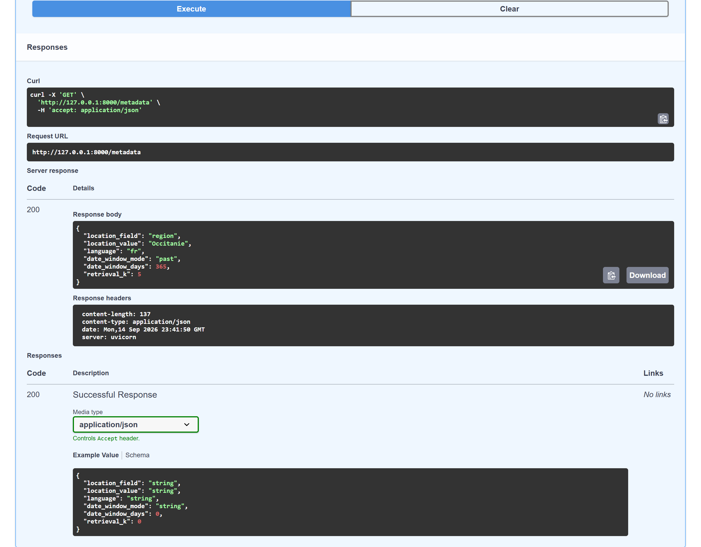
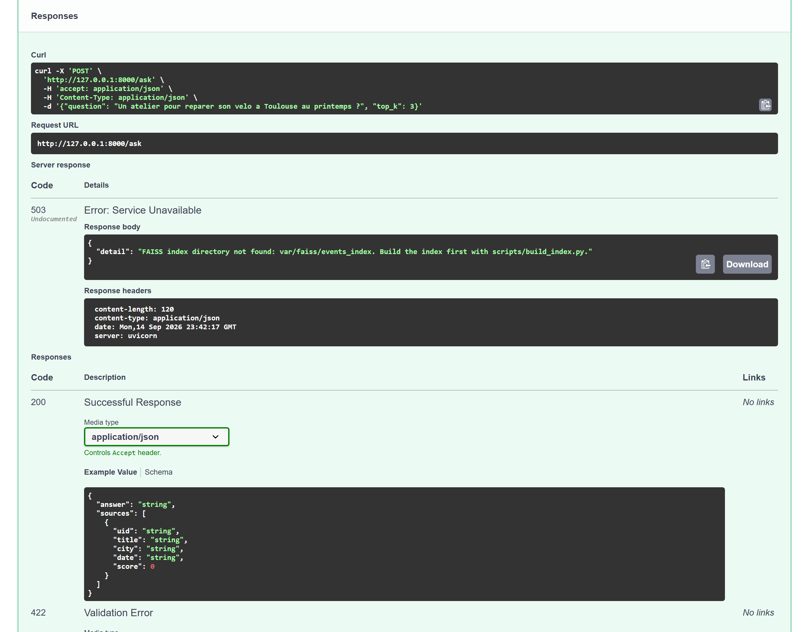

# Running and operating the service

## Starting it

```bash
cp .env.example .env                      # then set EVENTS_RAG_MISTRAL_API_KEY
uv sync
uv run python scripts/build_index.py      # ~1 min, 2 046 paid embedding calls
docker compose up                         # API on :8000, OpenAPI page at /docs
```

The index is written under `var/faiss/<index name>/` and is not committed: it is rebuilt from
the committed corpus, and rebuilding is cheaper than storing a few thousand vectors in git.
The container rebuilds it at image build time, so a fresh `docker compose up` needs the key
once.

Without a key the service still starts and `/health`, `/metadata` and the OpenAPI page all
answer. `/ask` returns 503 with a message naming the script that builds the index. That is
deliberate: a liveness probe that needed the model would report unhealthy for the minute the
index takes to load, and healthy afterwards even if the model behind it had gone.

## The four routes

The authority is the OpenAPI schema the application generates from its Pydantic models,
served at `/docs` and `/openapi.json` while the service runs. What follows is what the schema
cannot say: what each route costs, and how it fails.

**`GET /health`** answers `{"status": "ok"}` as soon as the process is up, without touching
the index or the model. That is what makes it usable as a container probe, and it is the
route the image's `HEALTHCHECK` calls.

**`GET /metadata`** returns what this deployment serves: the region and field the corpus was
filtered on, its language, the date window, and the number of documents retrieval asks for.
It is derived from the settings object, so it cannot drift from the running configuration.
Use it to tell two deployments apart before comparing their answers.

<!-- source: docs/images/MANIFEST.json -->


**`POST /ask`** is the product. It takes a question and an optional depth:

```json
{ "question": "Un atelier vélo à Toulouse au printemps ?", "top_k": 3 }
```

`question` is 3 to 500 characters and `top_k` is 1 to 10; both bounds are in the schema, so a
malformed call is refused before it reaches the model. The answer carries the events it was
built from, each with its `uid`, so any sentence can be traced to a record in the corpus. One
embedding call and one generation call per question, both paid, about 2.5 s end to end.

**`POST /rebuild`** re-embeds the committed corpus and replaces the index on disk. It takes
the token configured in `EVENTS_RAG_REBUILD_TOKEN`; without a token on the server the route
answers 500 rather than running unguarded, and with a wrong one it answers 403. It rebuilds
from `data/raw/events.json` and does not re-ingest: nothing here reaches the upstream portal.
This is the expensive route, which is why it is the only one behind a secret.

## Watching it

| Signal | Where | What it means |
|---|---|---|
| `GET /health` | the container's `HEALTHCHECK` | the process is up and serving |
| `GET /metadata` | manual | which corpus and which retrieval settings this deployment carries |
| `events_rag` structured logs | stdout, JSON | one line per question: the question, the depth, the number of documents retrieved |

The logs are structured, so a question that retrieved nothing is a field, not a sentence to
grep. `EVENTS_RAG_LOG_LEVEL` sets the level; the default is `INFO`, which logs one line per
answer and nothing per chunk.

## Rebuilding the index

Two ways, and they do the same work:

```bash
uv run python scripts/build_index.py
curl -X POST localhost:8000/rebuild -d '{"token":"..."}' -H 'Content-Type: application/json'
```

The route is guarded by `EVENTS_RAG_REBUILD_TOKEN`. An empty token on the server refuses every
call, which is the right default for a service nobody is watching. Rebuilding costs one
embedding call per chunk, so the guard is a cost control as much as a security one.

Rebuilding does **not** re-ingest. The corpus the service serves is the one committed beside
it, and replacing that corpus is a separate, documented act (`scripts/build_dataset.py`).

## What a run costs

Building the index makes 2 046 embedding calls, one per chunk, and takes about a minute.
Answering one question makes one embedding call and one generation call, about 2.5 s end to
end. The ablation builds three indexes and then searches locally, about three minutes. The
RAGAS evaluation makes thirty generations plus the judge's own calls, about ten minutes.
Those four figures are the whole bill: nothing else in the repository calls a paid API.

## When something is wrong

**The index is missing.** `/ask` answers 503. Run `scripts/build_index.py`, or check that
`EVENTS_RAG_INDEX_DIR` points where the index was written. This is the state a fresh clone is
in, and the refusal names the script instead of returning an answer built from nothing:

<!-- source: docs/images/MANIFEST.json -->


**A question fails validation.** `/ask` answers 400 when the question is under 3 characters,
over 500, or when `top_k` sits outside 1 to 10. The bounds are in the OpenAPI schema.

**Answers are correct but cite the wrong town.** Retrieval is working and the filter is not:
check `EVENTS_RAG_RETRIEVAL_K`, and read the city-filter row of the ablation table before
concluding anything from a single question.

**Everything answers, but nothing is found.** The index may have been built from a different
corpus. `var/faiss/<name>/manifest.json` records the chunking parameters, the embedding model
and the number of source documents it was built from; compare it with
`reports/corpus_profile.json`.

## Decommissioning

This deployment is archived. The model account that produced the published answers still
embeds and no longer completes, so the service runs locally, with a key of the reader's
own, or not at all. Nothing here depends on a hosted component: the
corpus, the question set, the results and the figure are all in the repository, and the only
external dependency is a model provider that a reader supplies themselves.
